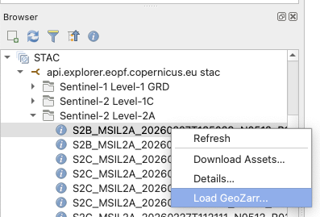
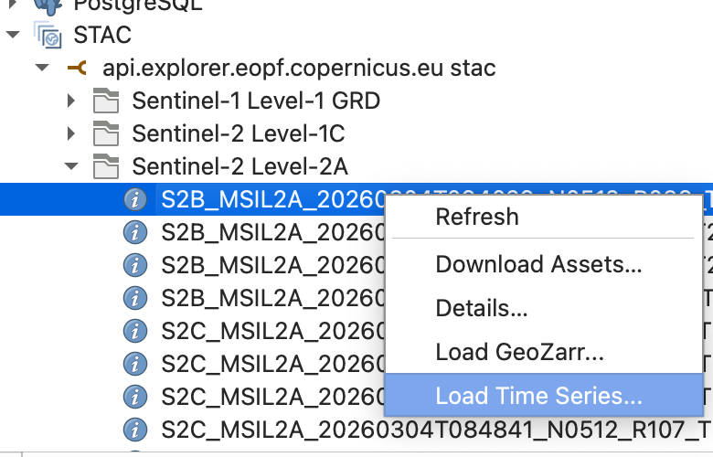

# GeoZarr for QGIS

Load cloud-native Zarr data from any STAC catalog - pick the bands and resolution you need, get a styled layer in seconds.

**QGIS 3.44+** | **Zarr v2 + v3**

## Quickstart

**1. Install the plugin**

Install from the [QGIS Plugin Repository](https://plugins.qgis.org/plugins/qgis_geozarr/): Plugins > Manage and Install Plugins > Search "GeoZarr" > Install.

Or download `qgis_geozarr.zip` from [Releases](https://github.com/wietzesuijker/qgis-geozarr/releases) and install from ZIP.

**2. Connect a STAC catalog**

QGIS has a built-in STAC browser (3.40+). The plugin adds a **Load GeoZarr...** action to it.

Open the Browser panel, right-click "STAC" > New Connection and add a catalog, e.g. `https://api.explorer.eopf.copernicus.eu/stac`.

**3. Load data**

Browse to a Zarr asset, right-click > **Load GeoZarr...**. Pick bands, choose a resolution, hit Load.



Or skip STAC entirely: click the GeoZarr toolbar icon and paste any Zarr store URL.

**4. Load a time series**

Right-click a STAC item > **Load Time Series...**. The plugin searches for all acquisitions of the same tile, loads them as temporal layers, and opens the QGIS Temporal Controller for frame-by-frame navigation.



## Time series demo

https://github.com/user-attachments/assets/6be1e202-82de-4955-bcb6-7fdb8bed9e08

## Features

- **Time series** - STAC search by tile, native QGIS temporal controller (IrregularStep), progressive loading
- **Band and resolution picker** with satellite presets (Sentinel-2, Landsat 8/9, MODIS, Sentinel-3)
- **Multiscale pyramids** from the multiscales convention - smooth zoom without extra downloads
- **Auto RGB styling** with stretch defaults tuned per satellite and data type
- **Cloud-optimized** out of the box - HTTP/2, parallel decode, connection pooling, shard index caching
- **URL loader** with recent history and clipboard paste

## Known limitations

- Zarr v3 sharding requires GDAL 3.13+. QGIS 3.44 ships this by default.
- CRS metadata (`proj:code`, `proj:projjson`, or EOPF `other_metadata`) recommended; warns if absent.

## Development

```bash
make test    # 110 tests
make lint    # ruff check
make zip     # build plugin zip
```

## License

GPL-2.0 - see [LICENSE](LICENSE)
